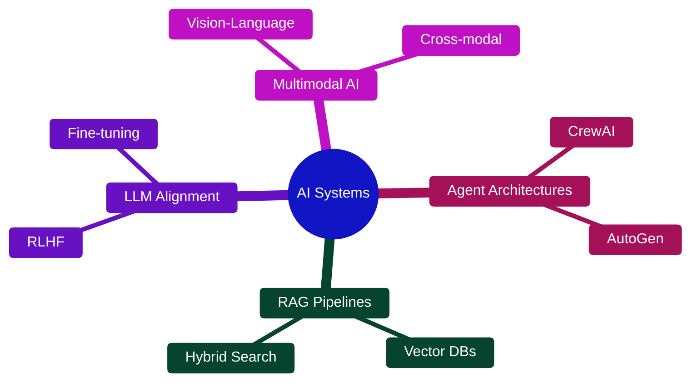

# Fateen Ahmed


<div align="center">

```
    ╔═══════════════════════════════════════════════════════╗
    ║                                                       ║
    ║        AI Engineer × Developer                        ║
    ║        MS Artificial Intelligence @ IIT               ║
    ║                                                       ║
    ╚═══════════════════════════════════════════════════════╝
```

[](https://www.linkedin.com/in/fateen-ahmed-a5b1171b6/)
[](https://alfa2k.github.io/alfa2k/)
[](mailto:fateenahmed.2k@gmail.com)

</div>

---

## 🌊 About

AI Engineer with experience at **Amazon** and **Byanat**. Building intelligent systems that leverage LLMs, agent frameworks, and cutting-edge ML.

```python
class Engineer:
    def __init__(self):
        self.passion = "Building AI that thinks"
        self.focus = ["LangChain", "AutoGen", "RAG", "Multimodal AI"]
    
    def current_mission(self):
        return "Architecting intelligent agent systems"
```

---

## ⚡ Tech Stack

<div align="center">

|  |  |  |
|:---:|:---:|:---:|
|  |  |  |
|  |  |  |
|  |  |  |

</div>

---

## 🎯 Current Focus

<div align="center">



</div>

---

## 🚀 What I'm Building

<div align="center">

| Area | Technology |
|:----:|:----------:|
| 🤖 **Intelligent Agents** | Multi-agent orchestration & collaboration |
| 📚 **Knowledge Systems** | Advanced RAG with vector databases |
| 🎯 **Model Training** | RLHF & preference learning |
| 🎨 **Multimodal Apps** | Vision-language model integration |

</div>

---

## 💡 Goal

<div align="center">

```
┌──────────────────────────────────────────────────┐
│                                                  │
│  "Build systems that don't just work—           │
│   they think, learn, and adapt."                │
│                                                  │
└──────────────────────────────────────────────────┘
```

**Open to collaborations on AI/ML projects**


</div>
