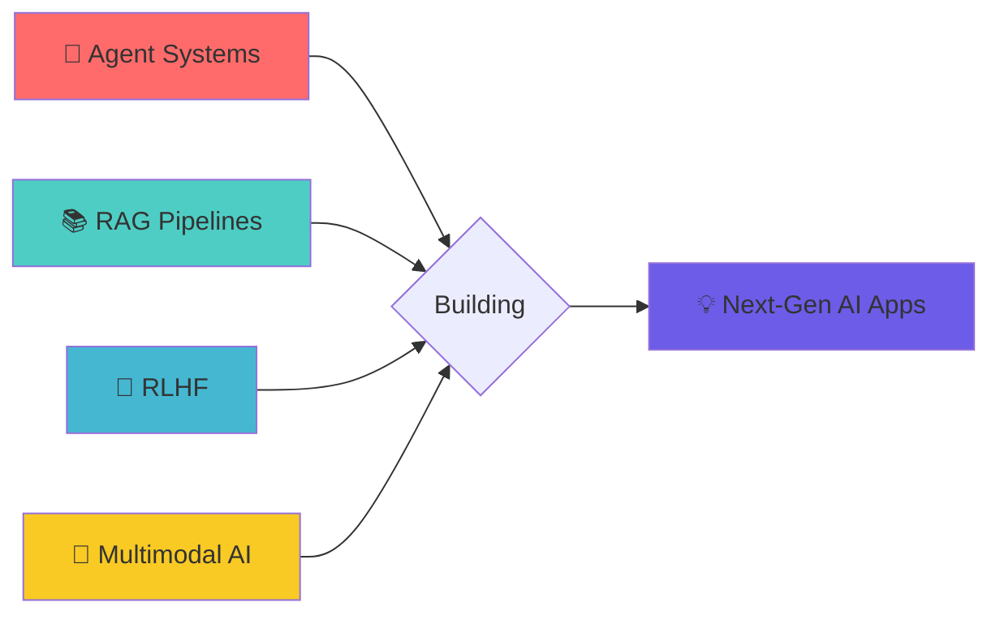

# 🚀 Fateen Ahmed

<div align="center">

```ascii
╔═══════════════════════════════════════════════════════════════╗
║                                                               ║
║     █████╗ ██╗    ███████╗███╗   ██╗ ██████╗ ██╗███████╗     ║
║    ██╔══██╗██║    ██╔════╝████╗  ██║██╔════╝ ██║██╔════╝     ║
║    ███████║██║    █████╗  ██╔██╗ ██║██║  ███╗██║█████╗       ║
║    ██╔══██║██║    ██╔══╝  ██║╚██╗██║██║   ██║██║██╔══╝       ║
║    ██║  ██║██║    ███████╗██║ ╚████║╚██████╔╝██║███████╗     ║
║    ╚═╝  ╚═╝╚═╝    ╚══════╝╚═╝  ╚═══╝ ╚═════╝ ╚═╝╚══════╝     ║
║                                                               ║
╚═══════════════════════════════════════════════════════════════╝
```

### 🤖 AI Engineer × 💻 Full Stack Sorcerer × 🧠 MS AI @ Illinois Tech

[](https://www.linkedin.com/in/fateen-ahmed-a5b1171b6/)
[](https://alfa2k.github.io/alfa2k/)
[](mailto:fateenahmed.2k@gmail.com)

</div>

---

## 🎯 Mission Control

```python
class FateenAhmed:
    def __init__(self):
        self.role = "AI Engineer & Full Stack Developer"
        self.education = "MS in Artificial Intelligence @ IIT"
        self.experience = ["Amazon", "Byanat"]
        self.current_obsession = [
            "🦜 LangChain Wizardry",
            "🤖 Multi-Agent Orchestration", 
            "🧠 RAG Architectures",
            "🎨 Multimodal AI"
        ]
    
    def daily_drive(self):
        return "Building intelligent systems that don't just work—they think."
    
    def tech_stack(self):
        return {
            "languages": ["Python", "JavaScript", "C++"],
            "ai_ml": ["LangChain", "AutoGen", "CrewAI", "LlamaIndex"],
            "frameworks": ["PyTorch", "TensorFlow", "React", "FastAPI"],
            "cloud": ["AWS", "Vector DBs"]
        }
```

---

## ⚡ Tech Arsenal

<div align="center">

### Core Languages


### AI/ML Toolkit


### Development Stack


</div>

---

## 🎪 Current Playground

<div align="center">



</div>

| 🔬 Research Area | 🎯 Focus |
|-----------------|---------|
| **Agent Architectures** | Multi-agent collaboration with CrewAI & AutoGen |
| **RAG Systems** | Vector database optimization & hybrid search |
| **LLM Alignment** | RLHF fine-tuning & preference learning |
| **Multimodal AI** | Vision-language models & cross-modal reasoning |


---

## 🤝 Let's Build Together

<div align="center">

**Open to collaborations on:**
- 🤖 Agentic AI Systems
- 🔍 Advanced RAG Applications  
- 🎯 LLM Fine-tuning Projects
- 🚀 Production ML Deployments

[](mailto:fateenahmed.2k@gmail.com)

</div>

---
